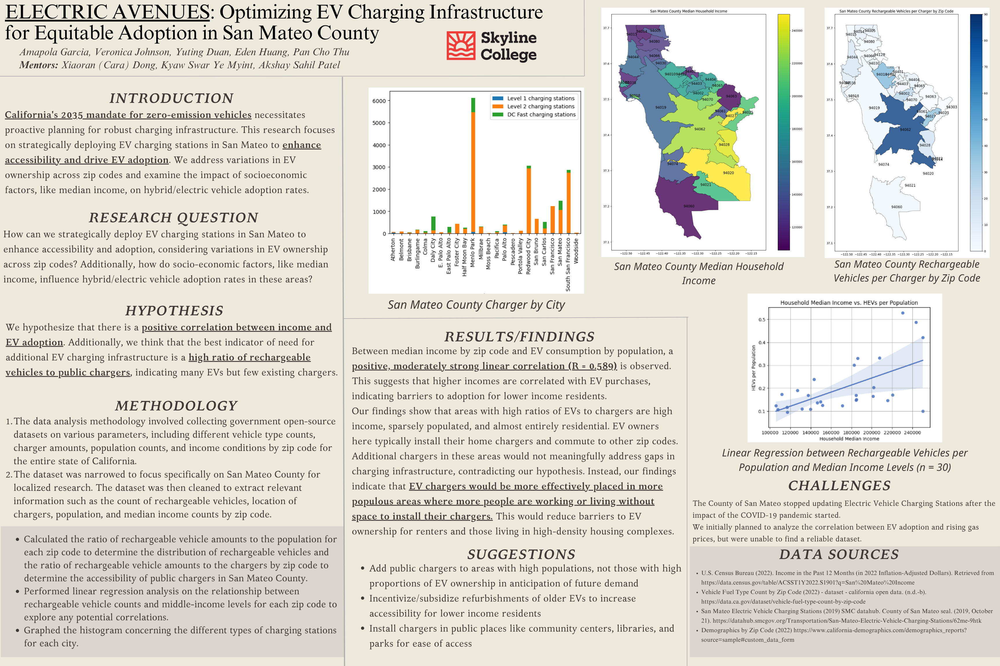

# EV Charging Infrastructure Analysis

**1st place out of 10 teams at DataJam 2024, presented at 
UC Berkeley's Data Discovery Conference**

Presented at [UC Berkeley's Data Discovery Conference](Data_Discovery.png)

## Project Poster

California's 2035 zero-emission vehicle mandate means EV 
charging infrastructure needs to scale fast. But is it being 
built in the right places? Our team analyzed San Mateo County 
to find out whether charging access is equitably distributed 
across income levels.

## What we found

There's a positive correlation (R = 0.589) between median 
household income and EV ownership across zip codes,  meaning 
higher income areas have more EVs but also already have more 
home chargers. Adding more public chargers to these areas 
wouldn't close the gap.

The real need is in higher density, lower-to-middle income 
areas where residents don't have home chargers and rely on 
public infrastructure. Our recommendation: prioritize charger 
installation in populated areas near workplaces, community 
centers, libraries, and parks, not in wealthy residential 
zip codes.

## Data Sources

- U.S. Census Bureau: median household income by zip code
- CalEVIP / California Open Data: vehicle fuel type counts
- San Mateo County Datahub: EV charging station locations

## What we did

- Merged 3 government datasets by zip code
- Calculated rechargeable vehicle to charger ratios per zip code
- Built a linear regression model (n = 30 zip codes)
- Mapped income and charging access across San Mateo County
- Identified underserved areas for targeted infrastructure investment

## Results

- R = 0.589 positive correlation between income and EV ownership
- High income areas are already well served by home chargers
- Public chargers are most needed in dense, lower-income areas
- EV chargers in wealthy residential areas would not meaningfully close the equity gap

## Tech Stack

Python, Pandas, GeoPandas, Matplotlib, Scipy

## Team

Amapola Garcia, Veronica Johnson, Yuting Duan, Eden Huang, 
Pan Cho Thu

Mentors: Xiaoran (Cara) Dong, Kyaw Swar Ye Myint, 
Akshay Sahil Patel

DataJam 2024 · Skyline College
